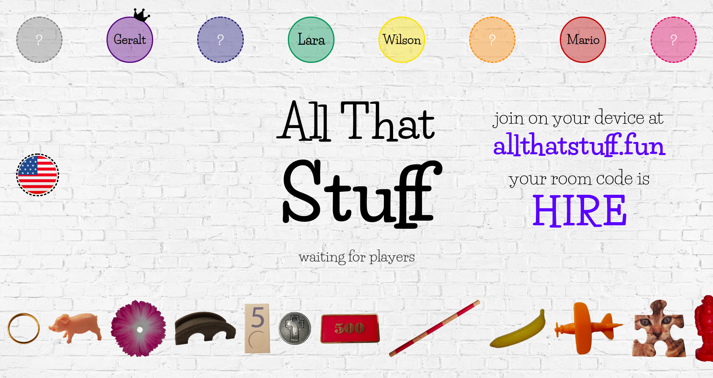

# AllThatStuff
Multiplayer word association game
(Version 3 with game lobby)

:cherry_blossom: [play](http://www.allthatstuff.fun/) :banana:

## Features
* Game lobby: players can either host or join a game
* Players take turns: One player "builds" a word while the other players guess what it is
* Select and drag&drop elements to make the other players guess a word
* Live update of moving elements for all players

setup for game lobby inspired by
https://github.com/InsomniacSabbir/anagrammatix

## Technologies
HTML5, CSS3, JavaScript, jQuery, Socket.IO

## Preview
### START MENU
<!--  -->

## Start the game locally
* npm start
* visit http://localhost:8080/ and click 'CREATE' to create a game
* visit http://localhost:8080/ (in another browser window) and click 'JOIN' to join a game
* at least 3 players (or incognito tabs) needed to play.

<!-- ### MAIN GAME

BUILDING:

GUESSING:

NEXT TURN:

### GAME END

 -->

<!-- ## Links & more
* look at the [word cards](http://www.allthatstuff.fun/cards)

* [cards json file](http://www.allthatstuff.fun/cards_enUS.json) -->
